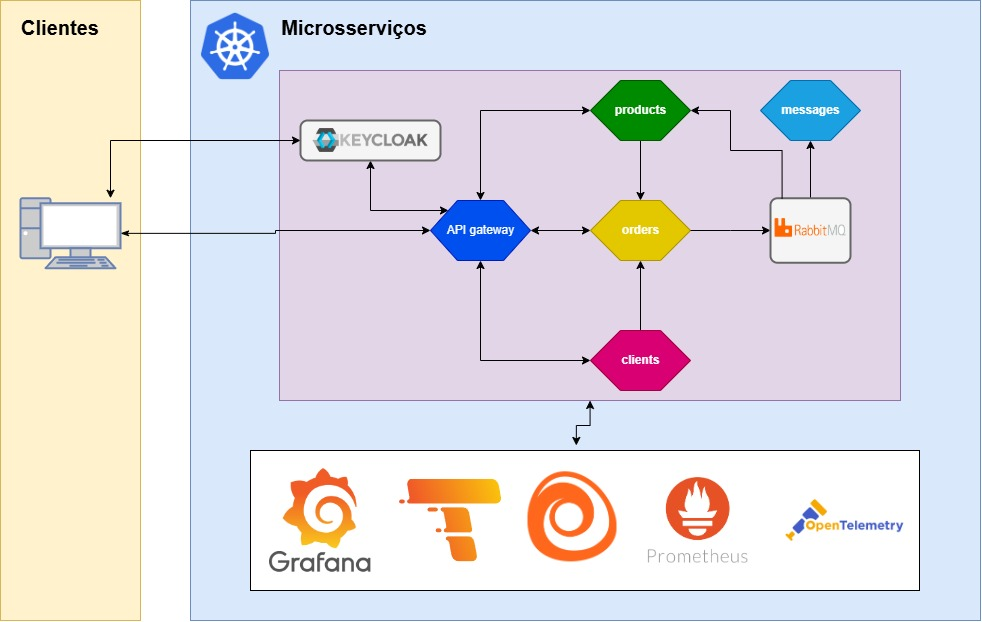

# Projeto iecommerce

Projeto pessoal de e-commerce backend, utilizando arquitetura de microsserviços para a gestão de produtos, pedidos e clientes. O sistema será construído com Java 21, Spring Boot e Spring Cloud, com persistência de dados com PostgreSQL, mensageria com RabbitMQ e autenticação e autorização com Keycloak. A infraestrutura contará com monitoramento completo via OpenTelemetry e ferramentas como Prometheus e Grafana, além de conteinerização com Docker e orquestração de contêineres com Kubernetes.

## Diagrama Arquitetural

## Tecnologias utilizadas

- **Java 21** — Linguagem principal utilizada para todos os microsserviços.
- **Spring Boot 3.4.5** — Framework backend utilizado.
- **Spring Cloud** — Comunicação e integração entre microsserviços.
- **PostgreSQL** — Banco de dados relacional para armazenamento dos dados dos serviços products, orders e clients.
- **RabbitMQ** — Mensageria assíncrona, funcionará como broker de mensagens. O serviço orders enviará informações de um pedido que servirão para gerar mensagens e emails de confimação e também para reduzir o estoque do serviço products.  
- **Spring Cloud Function** - Exposição de funções via API, que servirão para enviar mensagens ou notificar o serviço products sobre a dedução de um item de estoque.
- **Spring Cloud Stream** — Integração com a mensageria.
- **Keycloak** - O Keycloak será utilizado para autenticação e autorização, interagindo com o serviço de gateway e o serviço de clients do sistema.
- **Junit** - Testes unitários para o serviços.
- **OpenTelemetry + Prometheus + Grafana + Loki + Tempo + Alloy** — Observabilidade e monitoramento dos microsserviços, realizando o armazenamento e integração de Logs, rastreamento distribuído, visualização de métricas e controle de performance.
- **Docker** - Conteinerização das aplicações para realização de testes com Docker compose e para produção com kubernetes.
- **Kubernetes** - Orquestração de contêineres para a produção e testes.

## Executando o projeto

## Testes

## Contato

Para sugestões, dúvidas ou feedbacks, entre em contato:

- [LinkedIn](https://www.linkedin.com/in/icaro-augusto-rodrigues-de-freitas-4813ba92/)
- Email: icaro_freitas2014@outlook.com
